## Headings

You can use up to up to six levels by writing `#` at the start of a line. The number of hashtags defines the hierarchy of the heading. The first two headings render with a horizontal separator.

```Markdown
# First level
## Second level
### Third level
#### Fourth level
##### Fifth level
###### Sixth level
```

## Video

<figure>
  <video class="full-width ratio-3-1" autoplay playsinline muted loop controls>
    <source src="https://github.com/CodeEditApp/CodeEdit/assets/806104/89de4093-6370-488d-b74d-8499723d8ac5" type="video/mp4">
  </video>
  <figcaption>This is a video description</figcaption>
</figure>

<iframe class="wide" src="https://www.youtube.com/embed/nAchMctX4YA?si=K6HkdBhN5G9-G8Ni" title="YouTube video player" frameborder="0" allow="accelerometer; autoplay; clipboard-write; encrypted-media; gyroscope; picture-in-picture; web-share" allowfullscreen></iframe>

<blockquote data-theme="dark" class="twitter-tweet"><p lang="en" dir="ltr">📣 Calling all passionate <a href="https://twitter.com/hashtag/Swift?src=hash&amp;ref_src=twsrc%5Etfw">#Swift</a> devs! We invite you to shape the future of code editing. Join us in contributing to a free and <a href="https://twitter.com/hashtag/OpenSource?src=hash&amp;ref_src=twsrc%5Etfw">#OpenSource</a> project to build a native <a href="https://twitter.com/hashtag/CodeEditor?src=hash&amp;ref_src=twsrc%5Etfw">#CodeEditor</a> that unleashes the power of the Mac and complements Xcode.<a href="https://t.co/1gLjzN3tul">https://t.co/1gLjzN3tul</a></p>&mdash; CodeEdit (@CodeEditApp) <a href="https://twitter.com/CodeEditApp/status/1669723002832044034?ref_src=twsrc%5Etfw">June 16, 2023</a></blockquote> <script async src="https://platform.twitter.com/widgets.js" charset="utf-8"></script>

### Linking to Headings
In Markdown documents, each heading has its name as the identifier which you can [link to](#linking-to-headings) via a fragment.

```Markdown
[link to](#linking-to-headings)
```

## Emphasize
Emphasize text with different meanings.

### Bold
Use double astersik or double underscore before and after text to denote **bold**.

```Markdown
**bold**
__bold__
```

### Italic
Use single asterisk or underscore before and after text to denote *italic*.

```Markdown
*italic*
_italic_
```

### Strikethrough
Use double tildes before and after text to ~~strikethrough~~.

```Markdown
~~strikethrough~~
```

## Paragraphs
Use a blank line to separate one or more lines of text.

```Markdown
a paragraph

another paragraph
```

## Line Breaks
Use a backslash or two or more spaces at the end of a line, then type return to define a line break.

> [!NOTE]  
> This works inconsistently in Markdown documents versus comments. In a comment, a soft line break (return) does render a line break.

first line\
second line

```Markdown
first line\
second line
```

## Images


### Small image


```Markdown

```

### Normal image


```Markdown

```

### Wide image


```Markdown

```

### Full width image


```Markdown

```

### Small image with caption

<figure>
  
  <figcaption class="centered">A descriptive caption about the above image goes here to give the user more context about it.</figcaption>
</figure>

```Markdown
<figure>
  
  <figcaption class="centered">A descriptive caption about the above image goes here to give the user more context about it.</figcaption>
</figure>
```

### Normal image with caption

<figure>
  
  <figcaption>A descriptive caption about the above image goes here to give the user more context about it.</figcaption>
</figure>

```Markdown
<figure>
  
  <figcaption>A descriptive caption about the above image goes here to give the user more context about it.</figcaption>
</figure>
```

### Wide image with caption

<figure>
  
  <figcaption>A descriptive caption about the above image goes here to give the user more context about it.</figcaption>
</figure>

```Markdown
<figure>
  
  <figcaption>A descriptive caption about the above image goes here to give the user more context about it.</figcaption>
</figure>
```

### Full width image with caption

<figure>
  
  <figcaption>A descriptive caption about the above image goes here to give the user more context about it.</figcaption>
</figure>

```Markdown
<figure>
  
  <figcaption>A descriptive caption about the above image goes here to give the user more context about it.</figcaption>
</figure>
```

## Code

### Inline Code Block
Use a backtick before and after text to denote as `inline code`.

```Markdown
`code`
```

### Fenced Code Block
Use three backticks in a separate line before and after `code` or add at least four spaces to the start of a line.

````Markdown
```
code
```
````

```Markdown
code
```

### Syntax Highlighting
Add syntax highlighting by specifying a language next to the backticks before a fenced code block.

````Markdown
```javascript
function markdownRocks() {
  return true
}
```
````

### Escaping Backticks

Inline code blocks can be escaped using double backticks. Fenced code blocks using backticks can be escaped using three tildes `~~~` or four backticks `` ```` ``.

## Blockquotes
Add a greater-than sign in front of a paragraph.

> To create a blockquote.

```Markdown
> a quoted pragraph
> 
> another quoted paragraph
```

Or if you want to make the quote wide.

<blockquote class="wide">
  <p>An important quote that we want to call the readers attention to and emphasize in our article from the rest of the content.</p>
  <p>This is another quoted paragraph that we want to emphasize.</p>
</blockquote>

```Markdown
<blockquote class="wide">
  <p>An important quote that we want to call the readers attention to and emphasize in our article from the rest of the content.</p>
  <p>This is another quoted paragraph that we want to emphasize.</p>
</blockquote>
```

If you want to make the quote full width.

<blockquote class="full-width">
  <p>An important quote that we want to call the readers attention to and emphasize in our article from the rest of the content.</p>
  <p>This is another quoted paragraph that we want to emphasize.</p>
</blockquote>

```Markdown
<blockquote class="full-width">
  <p>An important quote that we want to call the readers attention to and emphasize in our article from the rest of the content.</p>
  <p>This is another quoted paragraph that we want to emphasize.</p>
</blockquote>
```

### Blockquote Footer

Add a blockquote footer to credit the author.

<blockquote>
  <p>An important quote that we want to call the readers attention to and emphasize in our article from the rest of the content.</p>
  <p>This is another quoted paragraph that we want to emphasize.</p>
  <footer>Steve Jobs, Apple Computers</footer>
</blockquote>

```Markdown
<blockquote>
  <p>An important quote that we want to call the readers attention to and emphasize in our article from the rest of the content.</p>
  <p>This is another quoted paragraph that we want to emphasize.</p>
  <footer>Steve Jobs, Apple Computers</footer>
</blockquote>
```

It even works with width classes.

<blockquote class="wide">
  <p>An important quote that we want to call the readers attention to and emphasize in our article from the rest of the content.</p>
  <p>This is another quoted paragraph that we want to emphasize.</p>
  <footer>Steve Jobs, Apple Computers</footer>
</blockquote>

```Markdown
<blockquote class="wide">
  <p>An important quote that we want to call the readers attention to and emphasize in our article from the rest of the content.</p>
  <p>This is another quoted paragraph that we want to emphasize.</p>
  <footer>Steve Jobs, Apple Computers</footer>
</blockquote>
```

### Nested Blockquotes
Add two greater-than signs in front of the paragraph you want to nest.

> a quoted paragraph
>> a quoted paragraph inside a quotation

```Markdown
> a quoted paragraph
>> a quoted paragraph inside a quotation
```

## Lists

### Numbered List
Add a figure followed by period, then a space and your content for each line item. The figure of the first item defines the sequence, figures of the following lines won't be considered.

1. numbered list item
2. numbered list item
3. numbered list item

```Markdown
1. numbered list item
2. numbered list item
3. numbered list item
```

### Bulleted Lists
Add an asterisk, dash or plus sign followed by period, then a space and your content for each line item.

* bulleted list item
* bulleted list item
* bulleted list item

```Markdown
* bulleted list item
* bulleted list item
* bulleted list item
```

### Task Lists
Add a dash followed by a space, then brackets **with a space in between**, then another space and your content for each task.

- [ ] Unfinished task list item
- [x] Finished task list item

```Markdown
- [ ] Unfinished task list item
- [x] Finished task list item
```

### Nesting Lists
Add two spaces to indent a list item and another two spaces for every next level. You can use up to ten levels. Mixing numbered and bulleted lists is possible.

* first level
  * second level

```Markdown
* first level
  * second level

1. first level
  1. second level

* first level unordered list item
  1. second level ordered list item
```

## Links
Add the text in brackets, then add the path or URL in parentheses.

```Markdown
[this is a link](http://github.com/)
```

## Images
Add an exclamation mark, followed by alt text in brackets, and the path or URL to the image asset in parentheses.

> [!NOTE]  
> The output automatically wraps the image in a link leading to the image url if no link is specified.

```Markdown

```

_For accessibility reasons, make sure the alt text describes the image content precisely!_

### Linking images
Add a link to an image by enclosing the Markdown for the image in brackets, and then add the link in parentheses.

```Markdown
[](http://github.com/image.jpg)
```

## Footnotes

Add a footnote in square brackets preceded by a caret and an identifier[^1]. The footnote content can be added by using the before mentioned construct followed by colon and then the content.

[^1]: Identifiers can be numbers or words without spaces or tabs.

```Markdown
Text with a footnote[^1].

[^1]: The footnote can be defined anywhere in the document but will be rendered at the end.
```

## Tables
Create a table by denoting each cell with pipe characters. Use three or more hyphens in the second row to create each column, this is mandatory. 

| column 1 | column 2 |
| -------- | -------- |
| cell     | cell     |
| cell     | cell     |

```Markdown
| column 1 | column 2 |
| -------- | -------- |
| cell     | cell     |
| cell     | cell     |
```

### Alignment
Add a colon to the left, right, or on both side of the hyphens in the second row to align text of the columns accordingly.

| column 1 | column 2 | column 3 |
| :------- | :------: | -------: |
| left     |  center  |    right |
| left     |  center  |    right |

```Markdown
| column 1 | column 2 | column 3 |
| :------- | :------: | -------: |
| left     |  center  |    right |
| left     |  center  |    right |
```

### Formatting Text
You can [emphasize](#Emphasize) text, add [links](#Links), [images](#Images) and [inline code blocks](#Inline-Code-Blocks) in tables.

## Horizontal Rules
Use three or more asterisks, dashes, or underscores alone on a line.

---

```Markdown
---
***
___
```

## Alerts

Alerts emphasize critical information. They are displayed with distinctive colors and icons to indicate the importance of the content.

> [!NOTE]
> Highlights information that users should take into account, even when skimming.

> [!TIP]
> Optional information to help a user be more successful.

> [!IMPORTANT] 
> Crucial information necessary for users to succeed.

> [!WARNING]
> Critical content demanding immediate user attention due to potential risks.

> [!CAUTION]
> Negative potential consequences of an action.

```markdown
> [!NOTE]
> Highlights information that users should take into account, even when skimming.

> [!TIP]
> Optional information to help a user be more successful.

> [!IMPORTANT]
> Crucial information necessary for users to succeed.

> [!WARNING]
> Critical content demanding immediate user attention due to potential risks.

> [!CAUTION]
> Negative potential consequences of an action.
```

## Mermaid Diagrams
Code blocks with the syntax highlighting set to `mermaid` renders dynamical diagrams using the [Mermaid syntax](https://mermaid.js.org/syntax/classDiagram.html).

```mermaid
stateDiagram
    direction LR
    Input --> Blackbox
    Blackbox --> Output
    state Blackbox {
      direction LR
      🪄 
    }
```



````

````
